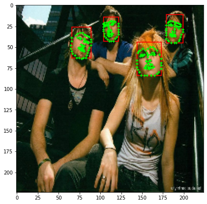

# Face boundry and facial landmark detection

## Goal

    
    

## Data set
[This data set](https://drive.google.com/file/d/1Jshwoo4KIDdCl_QkaWJ6HtGKC4JKOcU6/view?usp=sharing)
consists of 4275 images. Some images have multiple faces and some only have a person on it.

In this dataset, you can find annotations.txt which contains the labels including bounding box and landmarks annotations. The format of this text file is as follows (line by line):
* Path to image
* Number of faces in the image (n)
* For each face (n line): x y w h x1 x2 ... x68 y68 
    * x and y represent the top-left point of the bounding box
    * w and h are the width and height of the bounding box
    * (x1, y1) up to (x68, y68) are the 68 landmark positions in the face

## Notebook details
### First notebook
In [First notebook](./part1_face_boundary_detection.ipynb), I trained a vgg16 model with imagenet weights which has only two trainable layers. This model gets resized images of areas in images that selective search algorithm picked, then classify those resized parts into non-face and face categories. Also in this notebook I trained data with customized fit function. 

    
    

### Second notebook
In [Second notebook](./part2_facial_landmark_detection.ipynb), I trained a cnn model to estimate landmark positions on faces

### third notebook
In [Third notebook](./part3_face_boundary_and_facial_landmark_detection.ipynb), I give output of the first model to input of the second model, so I can detect face boundries and facial landmarks together. 🎉

    
    Original Image

    
    Resized image

    
    Resized image with estimated boundry box

    
    Resized faces (resized boundry box parts)

    
    Resized faces with estimated landmark positions

    
    Resized image with estimated boundry boxs and landmarks

    
    Original image with estimated estimated boundry boxs and landmarks

## Models

    

        Model first notebook (boundry box)
        
    

    

        Model second notebook (facial landmark)
        
    

## Refrences
[R-CNN implementation article](https://towardsdatascience.com/step-by-step-r-cnn-implementation-from-scratch-in-python-e97101ccde55)

[R-CNN implementation code](https://github.com/Hulkido/RCNN)

[Facial landmark detection code](https://github.com/LordLean/Facial-Landmark-Detection)

[Custom Fit](https://www.tensorflow.org/guide/keras/customizing_what_happens_in_fit)