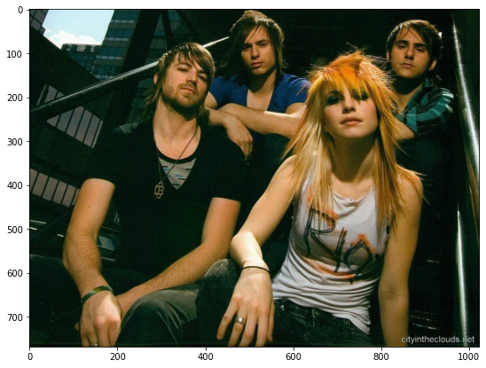
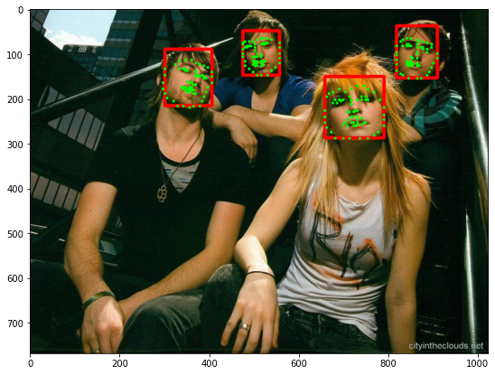
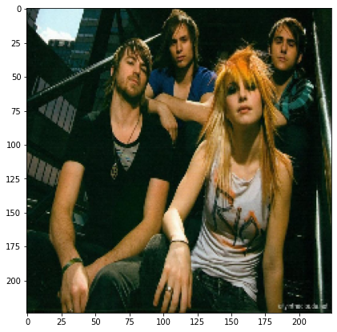
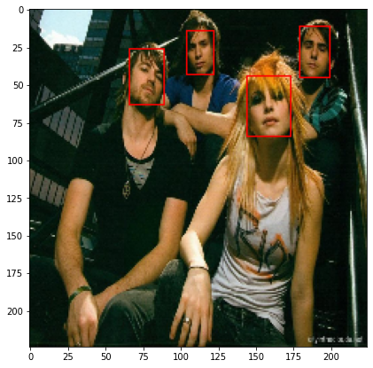
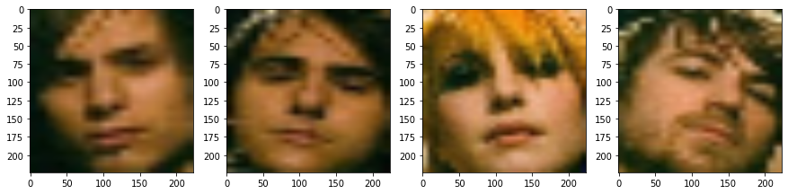
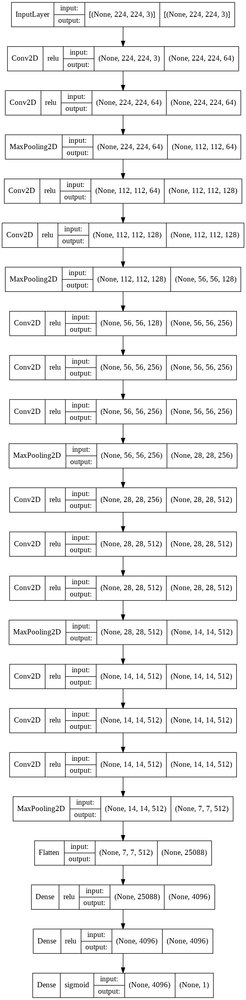
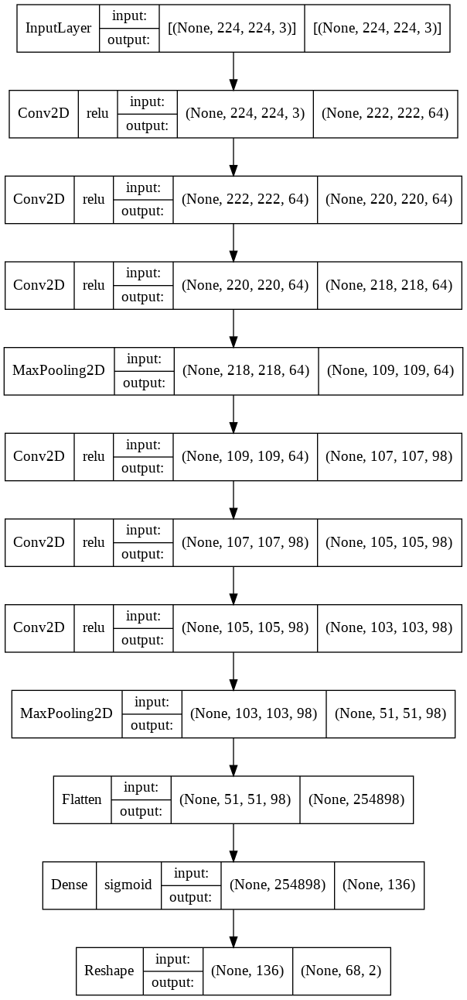

# Face boundry and facial landmark detection

## Goal

    
    

## Data set
[This data set](https://drive.google.com/file/d/1Jshwoo4KIDdCl_QkaWJ6HtGKC4JKOcU6/view?usp=sharing)
consists of 4275 images. Some images have multiple faces and some only have a person.

In this dataset, you can find annotations.txt which contains the labels including bounding box and landmarks annotations. The format of this text file is as follows (line by line):
* Path to image
* Number of faces in the image (n)
* For each face (n line): x y w h x1 x2 ... x68 y68 
    * x and y represent the top-left point of the bounding box
    * w and h are the width and height of the bounding box
    * (x1, y1) up to (x68, y68) are the 68 landmark positions in the face

## Notebooks details
### First notebook
In [First notebook](./part1_face_boundary_detection.ipynb), A vgg16 model with imagenet weights and only two trainable layers was trained. This model gets resized images of areas that selective search algorithm picks, then classifies those resized parts into non-face and face categories. Also in this notebook the model was trained with custom fit function. 

    
    

### Second notebook
In [Second notebook](./part2_facial_landmark_detection.ipynb), A cnn model was trained to estimate landmark positions on faces

### Third notebook
In [Third notebook](./part3_face_boundary_and_facial_landmark_detection.ipynb), The output of the first trained model were given to the input of the second trained model, so It can detects faces boundries and facial landmarks. 🎉

In this notebook you can see all the steps taken.

## Models

The models used in the first notebook and the second one.

## Refrences
[R-CNN implementation](https://towardsdatascience.com/step-by-step-r-cnn-implementation-from-scratch-in-python-e97101ccde55)

[R-CNN implementation](https://github.com/Hulkido/RCNN)

[Facial landmark detection](https://github.com/LordLean/Facial-Landmark-Detection)

[Custom Fit](https://www.tensorflow.org/guide/keras/customizing_what_happens_in_fit)